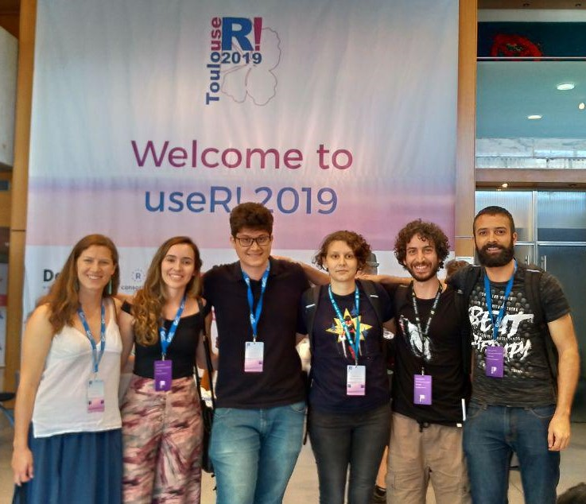

layout: true
  
<div class="my-footer"><span>

Twitter: https://twitter.com/satRdaySP  | Utilize a hashtag: #satRdaySP


</span></div> 

```{r setup, include=FALSE}
options(htmltools.dir.version = FALSE)
```
---
class: slide, middle 

## Sobre o satRday

.pull-left[

</br>
</br>
</br>
</img>

]

.pull-right[

+ O satRday é uma conferência focada em R, __a principal linguagem de código aberto__ de Ciência de Dados.

+ satRday é um __evento internacional__ que foi lançado em 2016.

+ O satRday foi patrocinado pela __RConsortium__, um projeto de código aberto da Linux Foundation que dá suporte à comunidade internacional de R.

+ Os eventos são sempre organizados com o envolvimento da comunidade local.
]


---
class: slide, middle 

## satRday em São Paulo...


```{r echo=FALSE, fig.align='center', out.width="70%"}

```

---
class: slide , middle, center

## Equipe organizadora

Adriana Reis, Angélica Custódio, Beatriz Milz, Bruna Wundervald, Caio Lente, Daniel Falbel, Fernanda Fortti, Gabriela Caesar

```{r echo=FALSE, fig.align='default', out.width="25%"}
knitr::include_graphics(c("img/team/adrianareis.jpg", 
                          "img/team/angelica.jpg",
                          "img/team/beamilz.jpg",
                          "img/team/brunaw.jpg",
                          "img/team/clente.jpg",
                          "img/team/danielfalbel.jpg",
                          "img/team/fernandafortti.jpg", 
                          "img/team/gabrielacaesar.jpg"))
```


---
class: slide , middle, center

## Equipe organizadora

 Gabriel Zanlorenssi, José de Jesus, Julio Trecenti, Letícia Thomaz, Mariana Dias Guilardi, Nathália Demétrio, Renata Hirota, William Amorim

```{r echo=FALSE, fig.align='default', out.width="25%"}
knitr::include_graphics(c(
                          "img/team/gabrielz.jpg",
                          "img/team/josejesus.jpg",
                          "img/team/juliotrecenti.jpg",
                          "img/team/leticiathomaz.jpg",
                          "img/team/mariguilardi.jpg",
                          "img/team/nathdemetrio.jpg",
                          "img/team/renatahirota.jpg",
                          "img/team/william.jpg"))
```


---
class: slide, middle

## Cronograma de hoje


09:00 - 09:30 - Abertura

09:30 - 10:30 - Palestras 

10:30 - 11:00 - Coffee Break

11:00 - 12:00 - Mesa redonda: Comunidades

12:00 - 13:30 - Horário de almoço - Livre

13:30 - 14:30 - Palestras 

14:30 - 15:00 - Palestra de Convidado(a)

15:00 - 15:30 - Coffee Break

15:30 - 16:30 - Palestra de Convidado(a)

16:30 - 16:45 - Encerramento

Apresentações em: https://github.com/satRdays/saopaulo2019_slides


---
class: slide, middle

## Patrocinadores

### Espaço

```{r echo=FALSE, fig.align='center', out.width="50%"}
knitr::include_graphics("img/logos/Insper-positivo.png")
```

---
class: slide, middle

## Patrocinadores

### Financeiro

```{r echo=FALSE, fig.align='center', out.width="45%"}
knitr::include_graphics("img/logos/cursor1-41.png")
```

<br><br>
```{r echo=FALSE, fig.align='center', out.width="45%"}
knitr::include_graphics("img/logos/clearsale-logo-rgb.png")
```


---
class: slide, middle

## Patrocinadores

### Financeiro


```{r echo=FALSE, fig.align='center', out.width="50%"}
knitr::include_graphics("img/logos/Marca_C6BANK_positivo.png")
```
<br><br>

```{r echo=FALSE, fig.align='center', out.width="50%"}
knitr::include_graphics("img/logos/logo_RED_Asset.jpg")
```


---
class: slide, middle

## Patrocinadores
### Brindes

```{r echo=FALSE, fig.align='center', out.width="50%"}
knitr::include_graphics("img/logos/CONRE-3-LOGO-OFICIAL-safira.png")
```

<br><br>
```{r echo=FALSE, fig.align='center', out.width="50%"}
knitr::include_graphics("img/logos/oracle-logo-1.png")
```
---
class: slide, middle

## Código de conduta

- O satRdays tem como objetivo proporcionar uma experiência de conferência livre de assédio e inclusiva para todos os participantes, independente, mas não limitado a, gênero, orientação sexual, deficiência, aparência física, idade, raça/etnia, posição social, religião ou afiliação política. 

- Não toleramos nenhuma forma de assédio aos participantes (incluindo organizadores e fornecedores). 

- Imagens e insinuações sexuais não são apropriadas em nenhum local da conferência, incluindo apresentações. 


- Qualquer pessoa que viole estas regras pode ser advertida ou expulsa da conferência (sem reembolso), conforme critérios dos organizadores da conferência. 

Saiba mais em: https://saopaulo2019.satrdays.org/codigodeconduta/

---
class: slide, middle

## Cuide dos seus pertences :) 

<br><br>
```{r echo=FALSE, fig.align='center', out.width="50%"}

```

---
class: slide, middle

## Para saber mais 

### satRday 

+ satRday : https://satrdays.org/ 

+ Base de conhecimento : https://knowledgebase.satrdays.org/

## R Consortium 

+ RConsortium : https://www.r-consortium.org/ 

## R 

+ Sobre o R : https://www.r-project.org/


---
class: slide 

background-image: url(img/photogrid_4-3.jpg)

---
class: contact, middle


# Contato 

## satrdaysp@gmail.com
