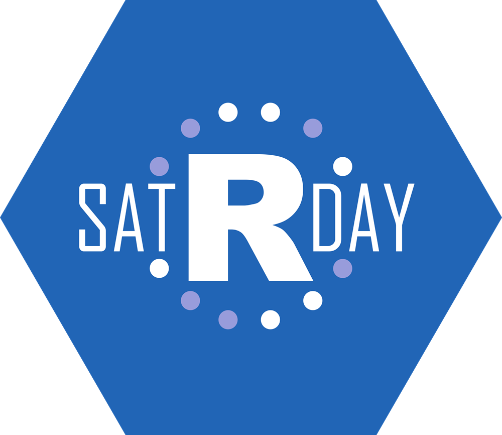

```{r setup, include=FALSE}
options(htmltools.dir.version = FALSE)
```

class: slide 

## Sobre o satRday

.pull-left[

</br>
</br>
</br>
</img>

]

.pull-right[

+ satRday é um __evento internacional__ que foi lançado em 2016.

+ O satRday foi patrocinado pela __RConsortium__, um projeto de código aberto da Linux Foundation que dá suporte à comunidade internacional de R.

+ É um projeto (relativamente) recente: nosso objetivo é organizar um evento por continente por trimestre.

+ Cada evento geralmente atrai entre 100 e 250 participantes.

+ Os eventos são sempre organizados com o envolvimento da comunidade local.
]

---
class: slide 

## A filosofia satRday
#### Aberto, e Código Aberto

Qualquer um pode organizar um satRday, desde que siga estes requisitos: 

+ O evento principal deve acontecer em um __Sábado__

+ O evento deve operar sob um __Código de Conduta__ e ter um __forte compromisso em aumentar a diversidade de palestrantes e participantes__

+ O preço do ingresso para participar do satRday de uma pessoa do setor industrial deve __custar menos de 8 horas de salário mínimo__ 

+ O evento tem uma __quantidade de ingressos gratuitos disponíveis para pessoas que não podem pagar__ o custo total

+ As pessoas palestrantes não devem ser obrigadas a pagar a taxa de inscrição

+ Deve haver um __mecanismo para incentivar e orientar novos(as) palestrantes__ 

+ O evento deve ser __organizado de forma voluntária__

+ __Os recursos em excesso devem ser utilizados para apoiar a comunidade local__ (grupos de usuários, RLadies, próximos satRdays, workshops, etc.) 

---
class: slide 

## Por que patrocinar o satRday?

Algumas boas razões para patrocinar um satRday:

+ O satRday é organizado por __voluntários__: ao patrocinar o evento, você mostra seu apoio à comunidade local de R e Código Aberto (Open Source).

+ O satRday é sem fins lucrativos: patrocínios e lucros (se houver) serão __investidos em eventos da comunidade__. 

+ O satRday é acessível: queremos __que a inscrição tenha o menor preço possível__. Isso só é possível devido aos nossos patrocinadores. 

+ O satRday está "na vanguarda": esta conferência tem como objetivo convidar palestrantes que são __líderes em seu campo de especialização__. 

+ O satRday é para todos: a programação está __preparada para atender usuários iniciantes e avançados__.

+ O satRday é inclusivo: ao patrocinar este evento, você __contribui para o esforço de incluir minorias no setor de ciência de dados/tecnologia__. 
---
class: slide 

##  Como patrocinar o satRday?

Como você pode ajudar o satRday?

+ __Patrocinando o Local__: Disponibilize seu local para o evento.

+ __Patrocinando o Almoço__: custeando o almoço.

+ __Patrocinando Coffee Break__: custeando um ou dois coffee breaks.

+ __Patrocinando a Logística__: suporte à logística geral do evento (ajuda no local com a instalação e organização geral do dia). 

+ __Patrocinando a Comunicação__: custeando a impressão de pôsteres, folhetos, custos de sites e marketing via mídia social.
+ __Patrocinando Brindes__: patrocina a criação de brindes para o evento: camisetas, adesivos etc.

+  __Patrocínio de finanças gerais__: Você patrocina o evento de maneira mais tradicional com uma doação financeira direta.

---
class: slide 

##  Considerações para patrocínio

Dependendo do seu patrocínio, você terá, em troca:

+ Visibilidade no __website__ e na __conta do Twitter__ do satRday. 

+ Seu __logo__ nos pôsteres, folhetos e programação. 

+ Seu __logo__ nos slides de abertura, intervalos e encerramento da conferência.   

+ Um __estande__, no local, durante os intervalos. 

---
class: slidish 

## satRday - Linha do tempo 

.pull-left[

### 2016 

+ Budapeste 

### 2017 

+ Cidade do Cabo 

+ Porto Rico

### 2018 

+ Cidade do Cabo 

+ Cardiff

+ Amsterdã

+ Belgrado 

+ Washington 
]

.pull-right[
</br>
</br>

```{r echo = FALSE, warning=FALSE, message=FALSE}
library(maps)
library(ggplot2)
library(dplyr)
events <- tribble(
  ~ place, ~ lat, ~ long,
  "Budapest",47.497912, 19.040235, 
  "Cape Town",-33.924869, 18.424055, 
  "Puerto Rico",18.220833, -66.590149, 
  "Cardiff",51.481581, -3.179090, 
  "Amsterdam",52.370216, 4.895168, 
  "Belgrade",44.786568, 20.448922, 
  "Washington",38.907192, -77.036871
)
map_data("world") %>% 
  ggplot(aes(long, lat, group=group)) +
  geom_polygon(fill="white", colour="gray") +
  geom_point(data = events, aes(long, lat, group = NULL), colour = "#3265B0", size = 2) + 
  guides(fill=FALSE) +
  coord_quickmap() +
  theme_void()
```

]

---
classe: slide 

## 2019

### A Equipe organizadora

.pull-left[

- Bruna Wundervald

- Beatriz Milz

- Julio Trecenti

- Daniel Falbel

- Caio Lente

- Nathália Demétrio

- William Amorim

- Fernanda Fortti

- Angélica Custódio

- Renata Hirota

- Hamanda Cavalheri

- Cecília do Lago


]

.pull-right[

- Letícia Thomaz

- José de Jesus

- Adriana Reis

- Mariana Dias Guilardi

- Gabriela Caesar

- Gabriel Zanlorenssi

]


---
class: slidish

## Sobre R

O satRday é uma conferência focada em R, __a principal linguagem de código aberto__ de Ciência de Dados.

.pull-left[

</br>
</br>
</img>

]

.pull-right[

+ R é __open source__: gratuito e de código aberto.

+ R está __em todos os lugares__: usado por __universidades__, __pesquisadores__ e na __indústria__. 

+ O R provou a si próprio: comemorou seu __aniversário de 25 anos__ este ano.

+ R é usado em todos os lugares:  Airbnb, BBC, Booking, Ebay, Facebook, Google, Microsoft, Netflix, Twitter, Uber... 

]

Atualmente, R é a __lingua franca de Data Science__ e se tornou um ativo profissional real, independentemente do setor de especialização. 

Os usuários do R podem ser encontrados em todos os lugares: no setor privado, com energia, finanças, bancos, indústria farmacêutica, marketing, comércio on-line e também no setor público, onde o R é usado em muitos ministérios.


---
class: slide

## Para saber mais 

### satRday 

+ satRday : https://satrdays.org/ 

+ Base de conhecimento : https://knowledgebase.satrdays.org/

## R Consortium 

+ RConsortium : https://www.r-consortium.org/ 

## R 

+ Sobre o R : https://www.r-project.org/

+ Empresas que utilizam R : https://github.com/ThinkR-open/companies-using-r

---
class: slide 

background-image: url(img/photogrid_4-3.jpg)

---
class: contact

</br>
</br>
</br>
</br>
</br>

# Contato 

## satrdaysp@gmail.com
